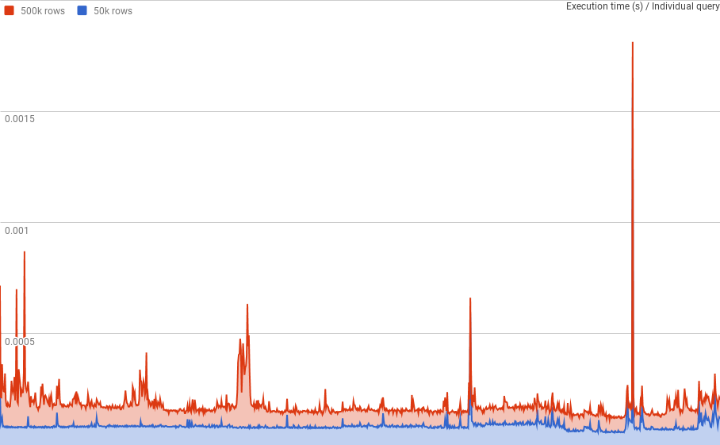

# Optimised binary UUIDs in Laravel

[](https://packagist.org/packages/spatie/laravel-binary-uuid)
[](https://travis-ci.org/spatie/laravel-binary-uuid)
[](https://insight.sensiolabs.com/projects/39e435d7-88b4-49ea-9822-ba4c68233a30)
[](https://scrutinizer-ci.com/g/spatie/laravel-binary-uuid)
[](https://styleci.io/repos/110949385)
[](https://packagist.org/packages/spatie/laravel-binary-uuid)

This package adds support for optimised binary encoded UUIDs in a MySQL database.

## Installation

You can install the package via composer:

```bash
composer require spatie/laravel-binary-uuid
```

## Usage

Optimised UUIDs are stored as a binary encoded string in the database. 
Besides storing them as binary, some bits are also switched, allowing MySQL to better index them. 
You can read more about this storing mechanism here: [http://mysqlserverteam.com/storing-uuid-values-in-mysql-tables/](http://mysqlserverteam.com/storing-uuid-values-in-mysql-tables/).
 
To let a model make use of these optimised UUIDs, you must add a `uuid` field as the primary field in the table.

```php
Schema::create('table_name', function (Blueprint $table) {
    $table->uuid('uuid');
    $table->primary('uuid');
});
```

Note that the name of the field can be chosen.

In the model, you can use the `HasBinaryUuid` trait which will add the required functionality to support the binary conversion of the UUID.

```php
use Illuminate\Database\Eloquent\Model;
use Spatie\BinaryUuid\HasBinaryUuid;

class TestModel extends Model
{
    use HasBinaryUuid;

    public $incrementing = false;
    protected $primaryKey = 'uuid';
}
```

Please note a few things:

- `$incrementing` must be `false` in order for the UUID to work as your primary key.
- If you're using any other name than `id` for the uuid, you must specify it in `$primaryKey`.

### Querying the model

The most optimal way to query the database is with the binary encoded version of a UUID. 
There's a scope included in the `HasBinaryUuid` trait to do exactly this.

```php
$uuid = 'ff8683dc-cadd-11e7-9547-8c85901eed2e'; // UUID from eg. the URL.

$model = MyModel::withUuid($uuid)->first();
``` 

The `withUuid` scope will automatically encode the UUID string to query the database.
The manual approach would be something like this.

```php
$model = MyModel::where('uuid', MyModel::encodeUuid($uuid))->first();
```

You can also query for multiple UUIDs using the `withUuid` scope.

```php
$models = MyModel::withUuid([
    'ff8683dc-cadd-11e7-9547-8c85901eed2e',
    'ff8683ab-cadd-11e7-9547-8c85900eed2t',
])->get();
```

#### Querying relations

You can also use the `withUuid` scope to query relation fields by specifying a field to query.

```php
$models = MyModel::withUuid('ff8683dc-cadd-11e7-9547-8c85901eed2e', 'relation_field')->get();

$models = MyModel::withUuid([
    'ff8683dc-cadd-11e7-9547-8c85901eed2e',
    'ff8683ab-cadd-11e7-9547-8c85900eed2t',
], 'relation_field')->get();
```

### Creating

The UUID of a model will automatically be generated upon save.

```php
$model = MyModel::create();

dump($model->uuid); // b"\x11þ╩ÓB#(ªë\x1FîàÉ\x1EÝ." 
```

### Human-readable UUID

UUIDs are only stored as binary in the database. You can however use a textual version for eg. URL generation.

```php
$model = MyModel::create();

dump($model->uuid_text); // "6dae40fa-cae0-11e7-80b6-8c85901eed2e" 
```

If you want to set a specific UUID before creating a model, that's also possible.
It's unlikely though that you'd ever want to do this.

```php
$model = new MyModel();

$model->uuid_text = $uuid;

$model->save();
```

### Benchmarks

Before making this module, we ran some benchmarks to determine whether it was worth the effort to work with optimised binary UUIDs.
These benchmarks are included in this repository and can be run with PHPUnit.
By default, PHPUnit won't execute them. Note that running the benchmarks can take several minutes!
You'll also need a MySQL database setup. Check the environment configuration in `phpunit.xml.dist` for more information. 

```
phpunit -d memory_limit=-1 --testsuite=benchmarks
```

These benchmarks will compare several ways of saving and querying data with IDs and UUIDs.
Average results are outputted in the terminal, while all individual query stats are saved in CSV files in the test folder.

You may use this data to further investigate the performance of UUIDs in your local machine.
We provided some charts based on benchmarks run by us. 

*Querying with normal IDs is the fastest.*



*Textual UUIDs by themselves are slow, and don't scale with bigger data sets.*


*The solution provided by this package allows for much better UUID lookups because they are binary encoded and optimised. 
This allows MySQL to better index them.*


### Testing

``` bash
composer test
```

### Changelog

Please see [CHANGELOG](CHANGELOG.md) for more information what has changed recently.

## Contributing

Please see [CONTRIBUTING](CONTRIBUTING.md) for details.

### Security

If you discover any security related issues, please email freek@spatie.be instead of using the issue tracker.

## Postcardware

You're free to use this package, but if it makes it to your production environment we highly appreciate you sending us a postcard from your hometown, mentioning which of our package(s) you are using.

Our address is: Spatie, Samberstraat 69D, 2060 Antwerp, Belgium.

We publish all received postcards [on our company website](https://spatie.be/en/opensource/postcards).

## Credits

- [Brent Roose](https://github.com/brendt)
- [All Contributors](../../contributors)

## Support us

Spatie is a webdesign agency based in Antwerp, Belgium. You'll find an overview of all our open source projects [on our website](https://spatie.be/opensource).

Does your business depend on our contributions? Reach out and support us on [Patreon](https://www.patreon.com/spatie). 
All pledges will be dedicated to allocating workforce on maintenance and new awesome stuff.

## License

The MIT License (MIT). Please see [License File](LICENSE.md) for more information.
